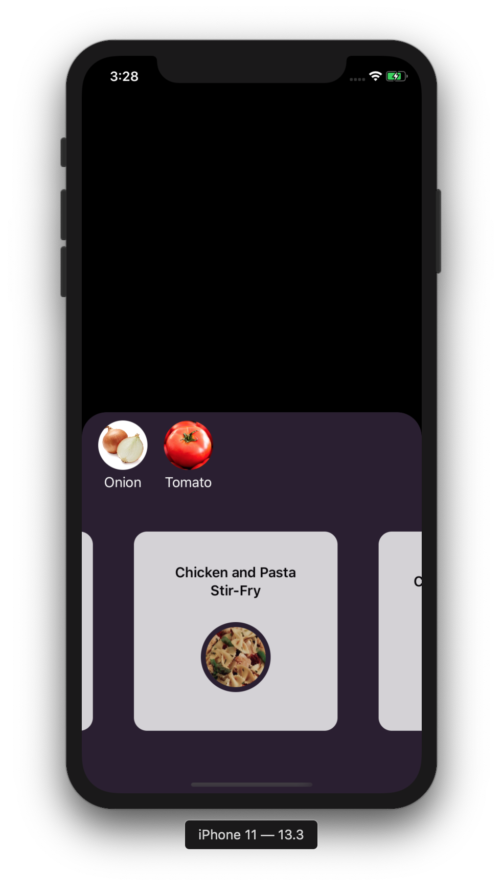

# LeftoverHero
### Swift app that identifies food ingredients in real-time video capture

Not sure what to make from your leftovers? Point the camera to your leftovers and it will suggest a recipe to make something delicious! LeftoverHero is a Swift app that uses a custom object detection model (Turi Create + CoreML) to detect ingredients and sends these ingredients to the Spoonacular API which suggests recipes. Clicking the recipe card results in a google search**.

{:height="50%" width="50%"}
{:height="50%" width="50%"}

### Model
The object detection model was trained on 355 images of tomato and onions sourced from google images annotated manually by me. Instead of implementing the model in TensorFlow from scratch, I used Apple's Turi Create since it makes it super easy to train an object detection model. Turi Create implements a custom version of the popular darknet yolo-v2 model.  Turi Create uses (mean) average precision 50 as performance indicators. This is the precision value when the Intersection over Union (IoU) threshold is fixed at 50%. A good explanation of these and other performance metrics of object detection models can be found here [4]. 

Currently the model is trained on two classes: **onions** and **tomatoes**. While the metrics show an unsatisfactory performance, the model in the app is test quite accurate and quick in detecting the right ingredient. Since we are using video, each object of interest is passed multiple times through the algorithm. This could explain why the model performance in the app is satisfactory.

| Performance metric | Value |
| ------ | ------ |
| Average precision 50 (Onion) | 0.001134558580815792
| Average precision 50 (Tomato)| 0.00124204286839813|
| Mean average precision 50 | 0.001188300782814622 |

### Technologies

Swift
CoreML
iOS (13.1+)

Turi Create
Python

Spoonacular API

### Performance
Mobile performance is a steady 32fps on iPhone 6S running iOS 13.1.

### License
MIT

### References
[1] Apple developer sample code for creating an object detection app: (https://developer.apple.com/documentation/vision/recognizing_objects_in_live_capture)

[2] Turi Create:
https://github.com/apple/turicreate 

[3] Spoonacular API
https://spoonacular.com/food-api

[4] Metrics of AP and mAP explained
https://mc.ai/the-confusing-metrics-of-ap-and-map-for-object-detection/ 

[5] LabelImg: graphical image annotation tool 
https://github.com/tzutalin/labelImg

